<div align="center">

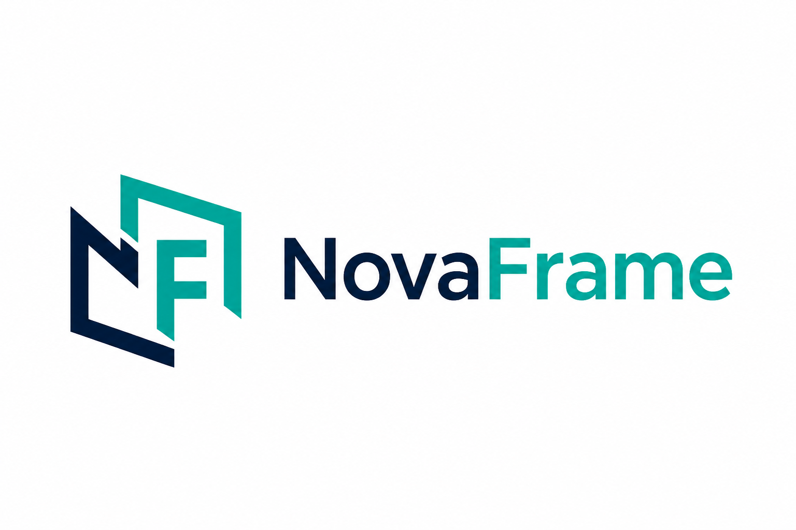

# Doğancan Çevik

**Full Stack Product Engineer** · Live SaaS · ERP · Meta Ads automation & predictive systems

I don't just ship features — I ship **revenue systems**: multi-tenant SaaS, ERP engines, AI assistants, and the ads that feed them.

[](https://github.com/dogancancevikk)
[](https://github.com/dogancancevikk)
[](https://github.com/dogancancevikk/novaframe)

[Live Product](https://emlakradar.app) · [NovaFrame](https://github.com/dogancancevikk/novaframe) · [Meta Ads Predictive](https://github.com/dogancancevikk/meta-ads-predictive) · [Altınova Cloud](https://github.com/dogancancevikk/altinova-cloud)

</div>

---

## Hiring signal (60-second scan)

| What you need | What I already built in production |
|---|---|
| Own a product end-to-end | Multi-tenant SaaS CRM live at [emlakradar.app](https://emlakradar.app) |
| Serious backend architecture | Custom PHP framework **NovaFrame** — Clean Architecture, DI, CSRF, rate limits |
| Full ERP ownership | [Altınova Cloud](https://github.com/dogancancevikk/altinova-cloud) — CRM, Quote Robot, SMS contracts, collections |
| Business outcomes, not only code | Lead funnels, WhatsApp automation, [predictive Meta Ads](https://github.com/dogancancevikk/meta-ads-predictive) |
| Self-directed engineer | Lise → production founder/builder (no CS degree, real systems) |

> **Code access policy:** Commercial product source is **private**. Public GitHub shows architecture + sanitized showcase. During interview I invite you to a time-boxed private review or live walkthrough.

---

## Featured product — EmlakRadar

**AI-assisted multi-tenant CRM for real-estate offices** · Live SaaS

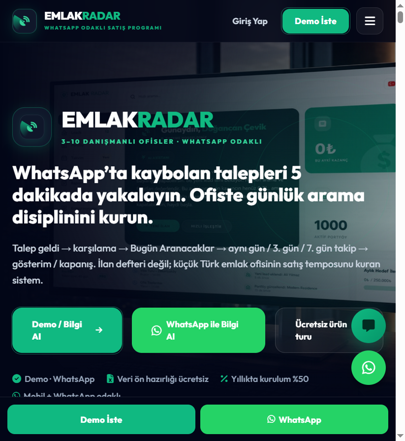

### Product UI

<p align="center">
  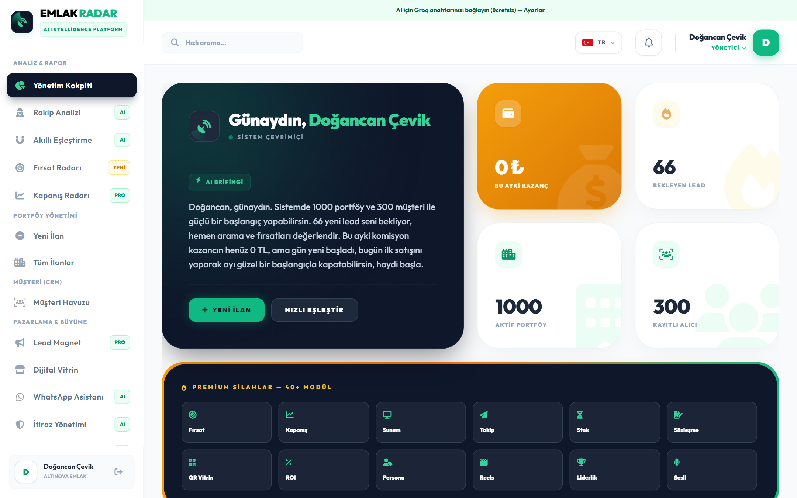
  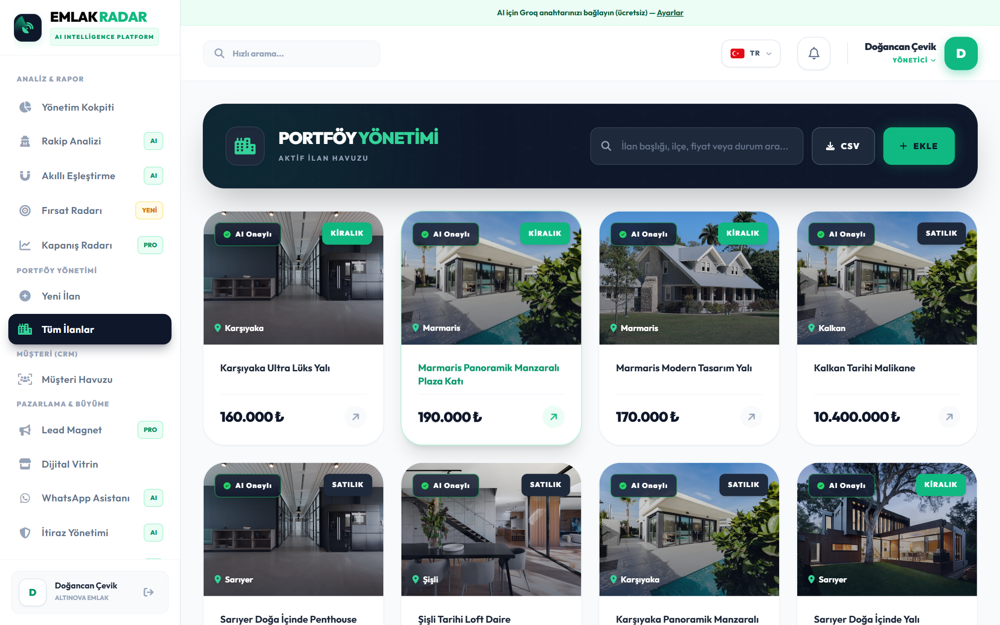
</p>
<p align="center">
  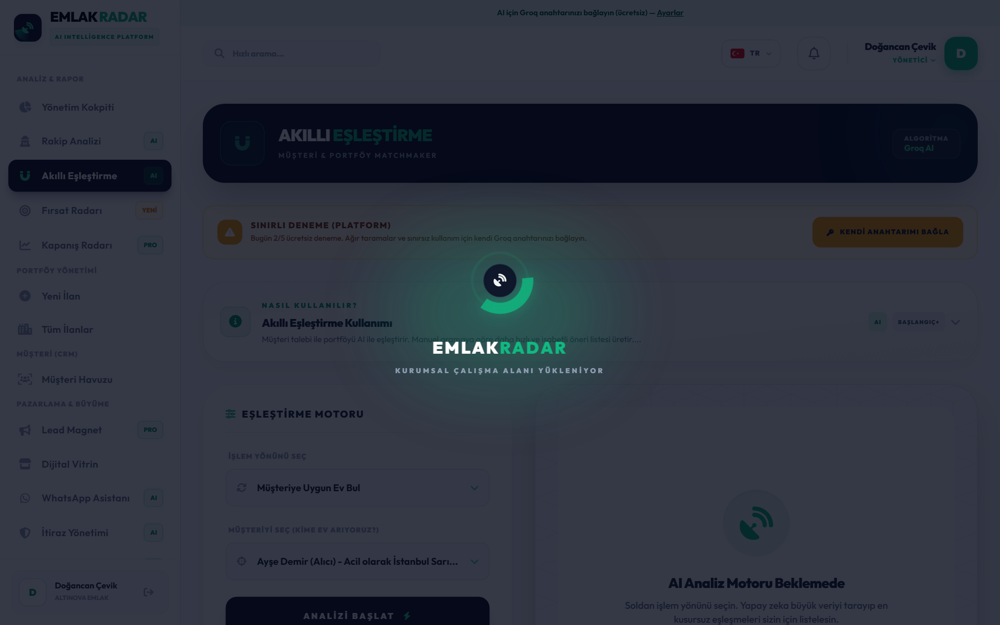
  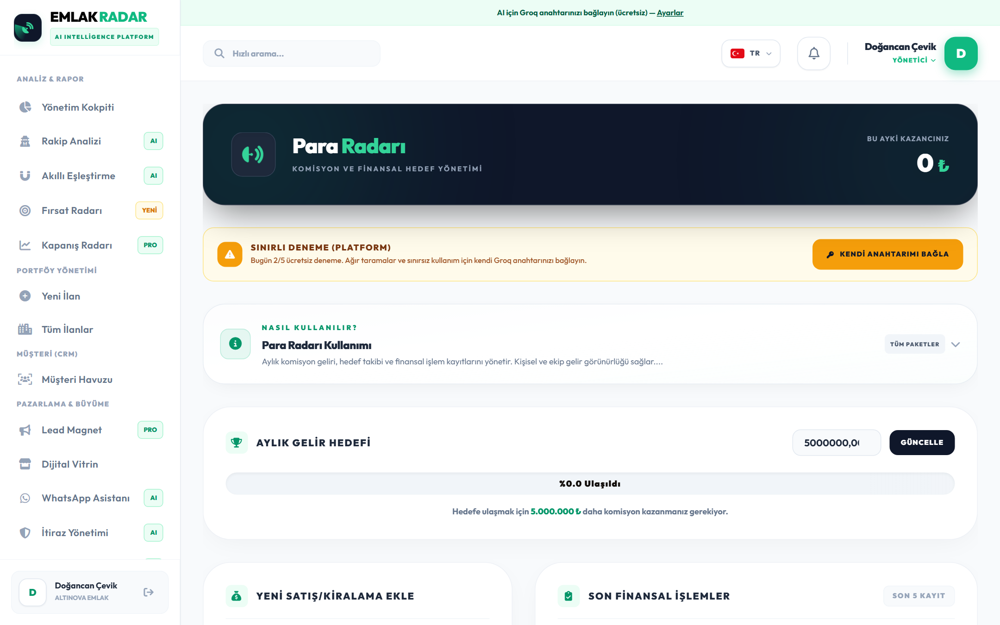
</p>

<p align="center">
  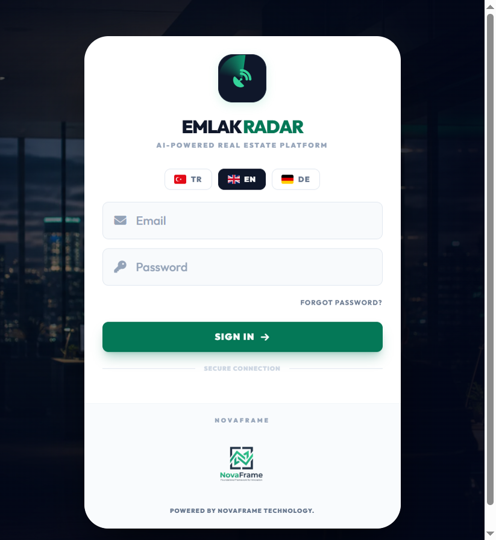
</p>

### What I built

- **Kokpit** — daily ops board (calls, appointments, money signals)
- **Matching engine** — region / budget / type scoring
- **WhatsApp demand bot + follow-up flows**
- **Portfolio + digital storefront**
- **Contracts / closing workflows**
- **Multi-tenant isolation** (organization-scoped data)
- **NovaFrame core** — CSRF, rate limiting, DI container, structured logs

**Stack:** PHP 8 · MySQL · Alpine.js · Tailwind · Gemini AI · GitHub Actions

---

## Production ERP — Altınova Cloud

**Construction / real-estate ops ERP** · Source **private** · Public docs + 1280px screens: [altinova-cloud](https://github.com/dogancancevikk/altinova-cloud)

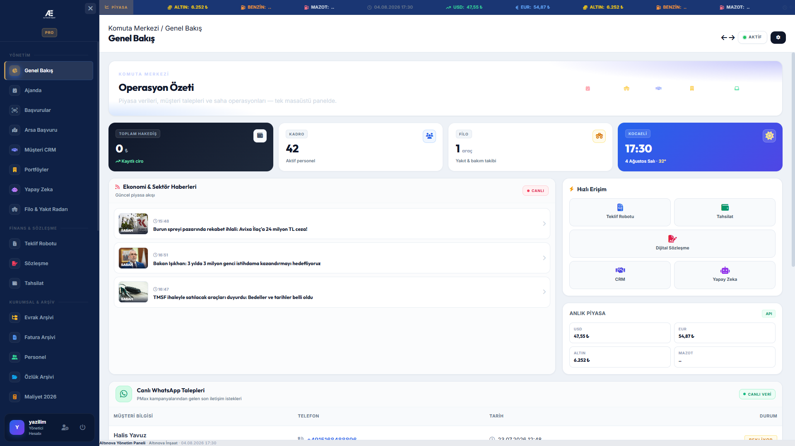

### Module UI

<p align="center">
  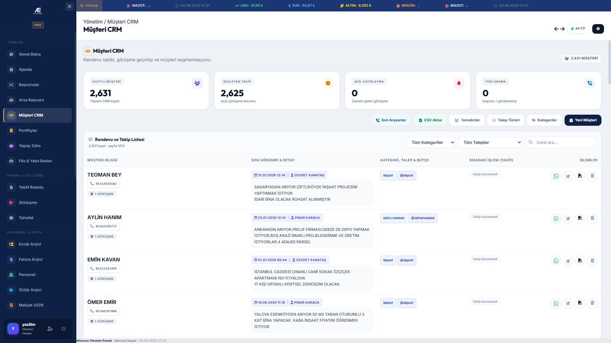
  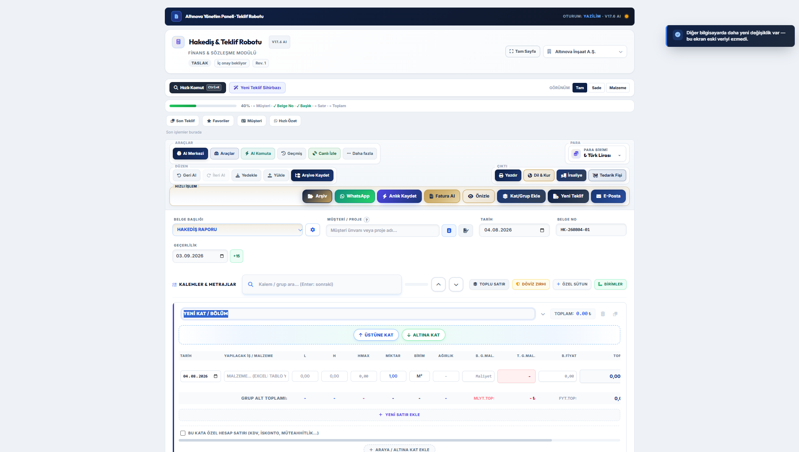
</p>
<p align="center">
  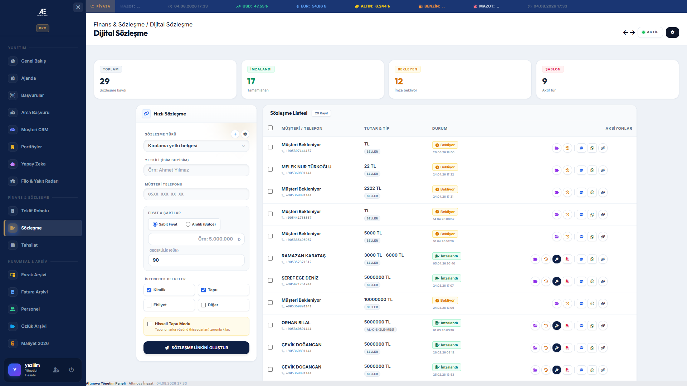
  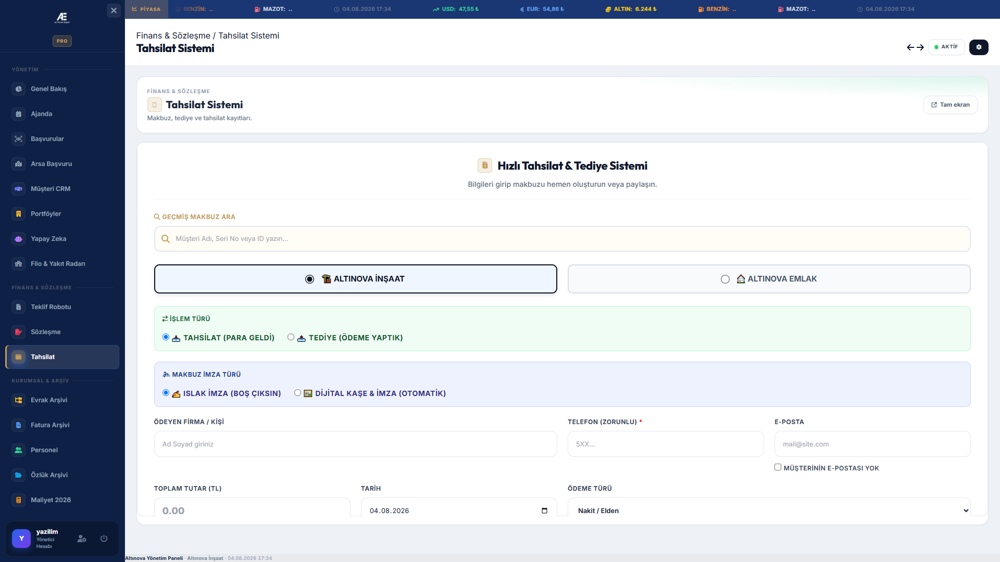
</p>

### What I built

- **Command Center** — live market ticker, KPIs, WhatsApp lead inbox
- **Customer CRM** — 2.6k+ records, follow-ups, categories, CSV import
- **Quote Robot V17** — quantity takeoff / progress payment, AI tools, PDF + multi-currency
- **Digital Contracts** — link generation, SMS OTP flow, templates, e-sign status
- **Collections** — receipts / payouts board
- **Also in panel:** fleet & fuel, HR / personnel files, document + invoice archive, unit costs, procurement, SEO tools

**Stack:** PHP · MySQL · Tailwind · SPA shell · VatanSMS · PDF / QR verification

> Commercial ERP source stays **private** (invite-only for interviews). Public proof = [feature docs + screenshots](https://github.com/dogancancevikk/altinova-cloud) + live walkthrough.

---

## Open-source architecture showcase — NovaFrame

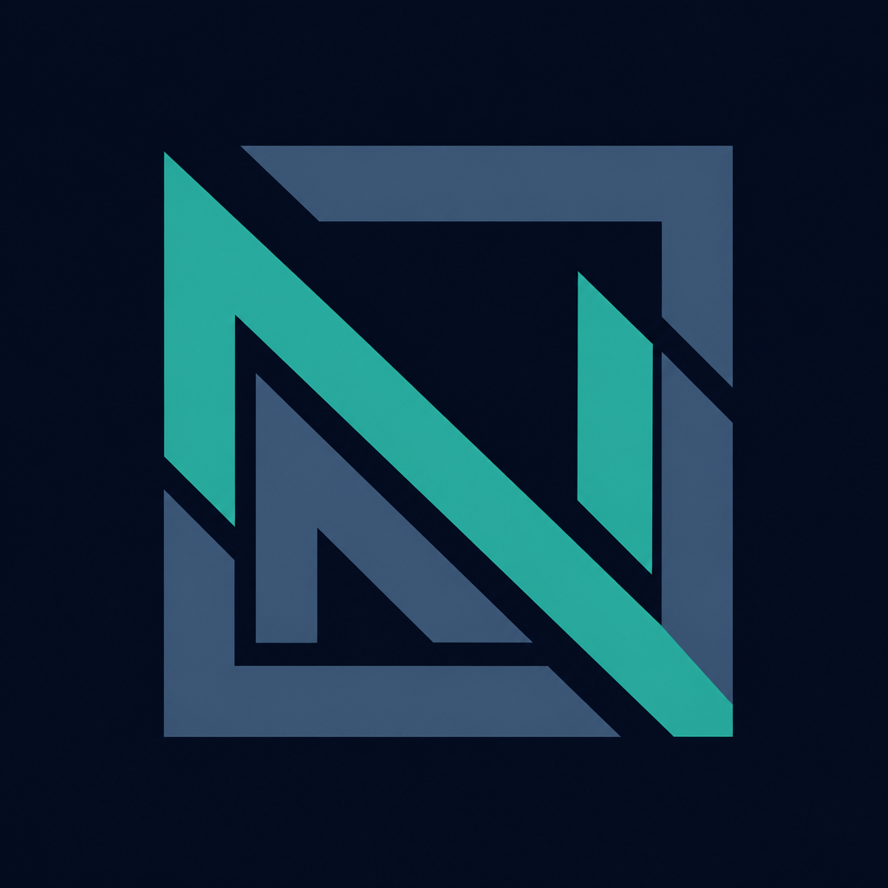

Public, sanitized framework extracted from the commercial SaaS — so engineering leads can evaluate **how I think**, without leaking proprietary IP.

→ **[github.com/dogancancevikk/novaframe](https://github.com/dogancancevikk/novaframe)**

```text
HTTP → Router → Middleware → Controller → Service → Repository → MySQL
```

| Layer | Responsibility |
|------|----------------|
| Controllers | Thin HTTP boundary |
| Services | Business rules |
| Repositories | Org-scoped data access |
| Security | CSRF · rate limit · prepared statements · `.env` secrets |

---

## Predictive Meta Ads — open core

I don't scale ads on today's ROAS. Production automation decides on **predicted D7/D14 CPA**, allocates budget with **Thompson Sampling**, and switches bid strategy from **hourly CPM**.

→ **[github.com/dogancancevikk/meta-ads-predictive](https://github.com/dogancancevikk/meta-ads-predictive)** · `npm test` runs offline (no token)

| Pillar | Signal |
|--------|--------|
| Conversion Lag | Cohort maturity → Lag Multiplier → SCALE / HOLD / CUT / KILL |
| Bayesian budget | Beta–Bernoulli arms + confidence intervals |
| Bid arbitrage | LOWEST_COST ↔ COST_CAP + CBO liquidity |

---

## Other production systems

| System | Role |
|--------|------|
| **Altınova Digital Ecosystem** | CMS, AI cost robot, SEO landings, Google Ads pipeline |
| **Meta Ads Brain** (private) | Full sync + apply + lead scoring on top of the public predictive core |

---

## Tech I use to ship

```text
Backend     PHP 8 (strict) · Node.js · REST · PDO · multi-tenant
Frontend    React · Alpine.js · Tailwind · Vite
Data        MySQL 8 · migrations · parameterized queries
Architecture Clean Architecture · Repository · DI · SOLID
AI          Gemini — briefings, matching, WhatsApp assistants
Growth      Google Ads · Meta Marketing API · GTM · SEO
DevOps      Git · GitHub Actions · Linux hosting · secrets hygiene
```

---

## How I work with hiring teams

1. You review this profile + live product ([emlakradar.app](https://emlakradar.app))
2. You review public **NovaFrame** + **Meta Ads Predictive** cores (`npm test` / `npm run demo`)
3. If serious → I grant **48h private repo access** or do a **screen-share code tour**
4. Take-home / pair session welcome

**Looking for:** Remote / hybrid full-stack or product-engineering roles where ownership matters.

---

<div align="center">

### Built with NovaFrame

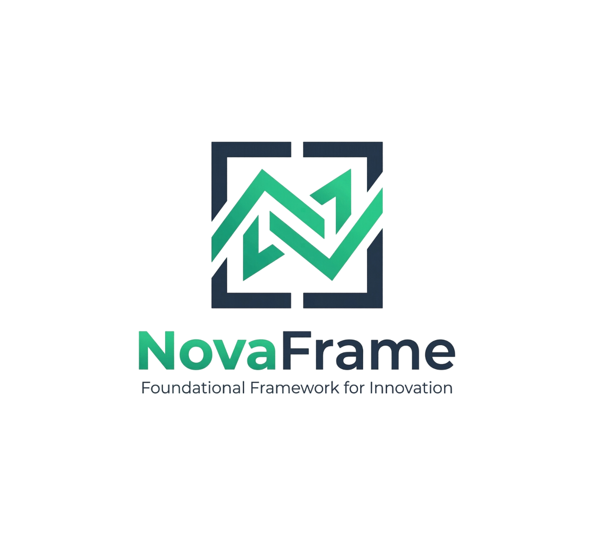

**Doğancan Çevik** · [github.com/dogancancevikk](https://github.com/dogancancevikk)

</div>
